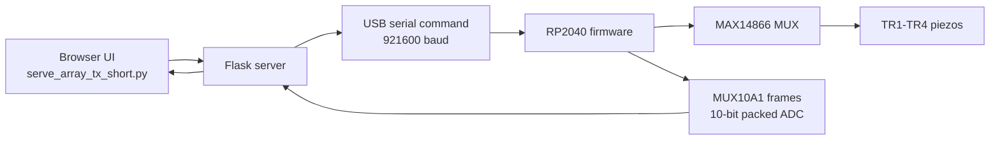
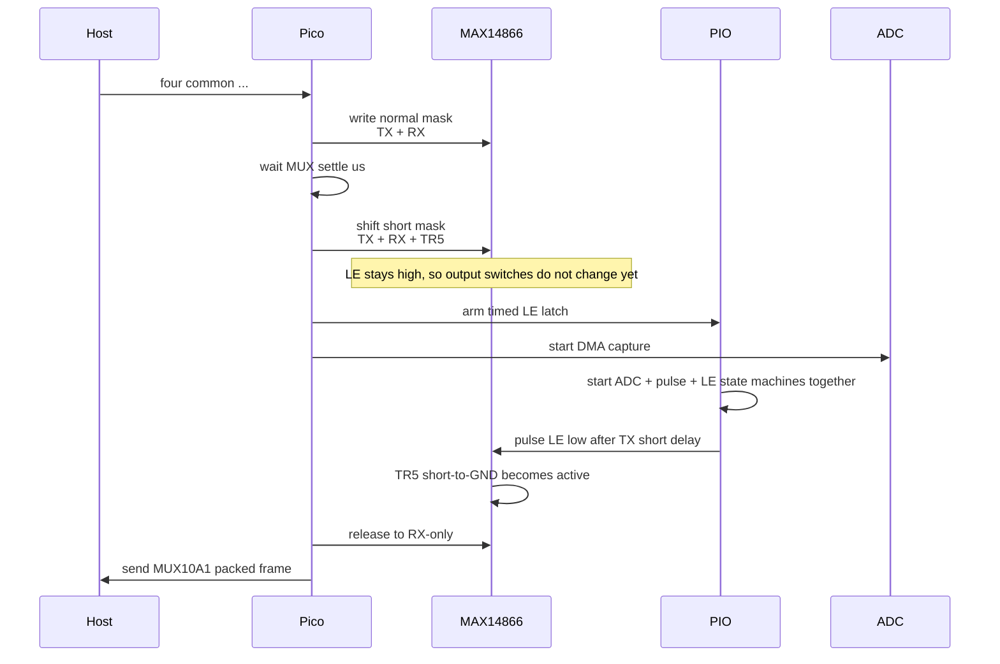

<div align="center">

# pic0rick-4ch

**RP2040 4-channel MAX14866 ultrasound MUX scanner with timed TX short-to-GND**

<p>
  
  
  
  
  
</p>

</div>

This is a clean release folder for the current **pic0rick 4-channel MUX experiment**.
It targets the original Raspberry Pi Pico / **RP2040** board.

Ready-to-flash firmware:

```text
firmware/tx_short_extra_gnd_rp2040.uf2
```

## Quick Start

| Step | What to do |
| --- | --- |
| 1 | Flash `firmware/tx_short_extra_gnd_rp2040.uf2` to the Pico in BOOTSEL mode. |
| 2 | Install Python dependencies from this folder. |
| 3 | Start the live browser interface. |
| 4 | Open `http://127.0.0.1:5176/`. |

```bash
python3 -m venv .venv
. .venv/bin/activate
pip install -r requirements.txt
python serve_array_tx_short.py
```

## What It Runs

The firmware scans all directed TX/RX pairs across four piezo channels:

| TX channel | RX channels |
| --- | --- |
| `TX1` | `RX2`, `RX3`, `RX4` |
| `TX2` | `RX1`, `RX3`, `RX4` |
| `TX3` | `RX1`, `RX2`, `RX4` |
| `TX4` | `RX1`, `RX2`, `RX3` |

Then it repeats continuously.

Current hardware mapping:

| MUX node | Use |
| --- | --- |
| `TR1-TR4` | Piezo channels |
| `TR5` | Common short-to-GND path after each transmit pulse |
| `TR6-TR8` | Unused in this release |

The purpose of the `TR5` short is to reduce TX ringdown/feedthrough after the pulse while keeping the scan sequence fast.

## System Flow



## Default Live Settings

| Setting | Default | Notes |
| --- | ---: | --- |
| DAC gain | `150` | Sent as `write dac 150` before streaming |
| pon ns | `167` | Pulse timing |
| poff ns | `167` | Pulse timing |
| damp ns | `10000` | Existing pic0rick damping parameter |
| samples/path | `2000` | Fixed in the UI |
| MUX settle us | `10` | Delay after selecting the TX/RX path |
| TX short delay us | `3` | PIO-timed delay before latching the short mask |

At 60 MHz sampling:

```text
2000 samples / 60 MHz = 33.33 us per path
```

## Host-To-Pico Command

The browser does not talk to the Pico directly. The server sends text commands over USB serial.

Current scan command:

```text
four common <samples> <pon_ns> <poff_ns> <damp_ns> <mux_settle_us> <rx_blank_us> <tx_short_delay_us> <tx_short_hold_us>
```

With the default UI settings, it is:

```text
four common 2000 167 167 10000 10 0 3 50
```

The DAC is sent separately first:

```text
write dac 150
```

## Per-Path Timing

For each path, such as `TX1 -> RX2`, the firmware does this:



The important idea is that the firmware **preloads** the short mask before the high-voltage pulse, then uses a PIO-timed LE pulse to apply it. This avoids clocking SPI data into the MAX14866 during the transmit burst.

## MAX14866 Masks

Inside the firmware, channels are zero-based:

| User label | Firmware index |
| --- | ---: |
| Channel 1 | `0` |
| Channel 2 | `1` |
| Channel 3 | `2` |
| Channel 4 | `3` |

Switch-bit helpers are in `firmware/adc/adc.c`:

```c
static uint16_t mux_rx_bit(uint8_t channel)
{
    return (uint16_t)(1u << (channel * 2u));
}

static uint16_t mux_tx_bit(uint8_t channel)
{
    return (uint16_t)(1u << (channel * 2u + 1u));
}

static uint16_t mux_tx_short_bit(uint8_t channel)
{
    return mux_tx_bit((uint8_t)(channel + 4u));
}
```

Example for `TX1 -> RX2`:

| Mask | Meaning | Value |
| --- | --- | ---: |
| `mux_mask` | `TX1 + RX2` | `0x0006` |
| `short_mask` | `TX1 + RX2 + TR5` | `0x0206` |
| `release_mask` | `RX2 only` | `0x0004` |

## Binary Frame Format

Frames are parsed in `host/run_array_test.py`.

```python
MAGIC = b"MUX10A1"
HEADER = struct.Struct("<BBBHIH")
```

After `MUX10A1`, each frame contains:

| Field | Type | Meaning |
| --- | --- | --- |
| `mode` | `uint8` | Scan mode |
| `tx` | `uint8` | 1-based TX channel |
| `rx_mask` | `uint8` | Enabled RX channel mask |
| `count` | `uint16` | Samples in this path |
| `sequence` | `uint32` | Frame sequence counter |
| `mux_mask` | `uint16` | MAX14866 mask used for this frame |

Samples are sent as packed 10-bit ADC values:

```text
payload_size = ceil(sample_count * 10 / 8)
```

For the current 12-path scan:

```text
2000 samples/path * 10 bits = 2500 bytes/path
2500 bytes/path * 12 paths = 30000 bytes/scan
```

## File Map

| File | Role |
| --- | --- |
| `serve_array_tx_short.py` | Live Flask interface, serial worker, browser UI |
| `host/run_array_test.py` | Serial frame reader and 10-bit unpacking helper |
| `firmware/main.c` | Text command parser and command dispatch |
| `firmware/adc/adc.c` | 4-channel path sequence, masks, DMA, packed frame writer |
| `firmware/adc/adc.pio` | ADC sampler, pulse timing, PIO-timed LE latch |
| `firmware/max/max14866.c` | MAX14866 shift/latch helper |
| `firmware/max/max14866.pio` | PIO-based MAX14866 serial output |

<details>
<summary><b>Code-level command flow</b></summary>

1. The live UI defaults are stored in `serve_array_tx_short.py`:

   ```python
   SETTINGS_DEFAULTS = {
       "dac": 150,
       "pon": 167,
       "poff": 167,
       "damp": 10000,
       "samples": 2000,
       "settle_us": 10,
       "blank_us": 0,
       "short_delay_us": 3,
       "short_hold_us": 50,
   }
   ```

2. When Start live is pressed, the browser calls:

   ```text
   POST /stream/start
   ```

3. `serve_array_tx_short.py` starts `hardware_worker(settings)`, opens the Pico serial port, and sends:

   ```text
   write dac <dac_gain>
   four common <samples> <pon_ns> <poff_ns> <damp_ns> <mux_settle_us> <rx_blank_us> <tx_short_delay_us> <tx_short_hold_us>
   ```

4. `firmware/main.c` dispatches the command:

   ```c
   {"four common", adc_four_common_short_stream},
   ```

5. `adc_four_common_short_stream()` defines the 12 directed paths and calls:

   ```c
   adc_mux_pairwise_short_stream(data, tx_channels, rx_channels, 12, true);
   ```

6. The final `true` enables the common `TR5` short-to-GND behavior.

</details>

<details>
<summary><b>PIO timing details</b></summary>

The synchronized acquisition is handled by `run_adc_acquisition_tx_short()` in `firmware/adc/adc.c`.

It:

1. clears the ADC PIO FIFO
2. configures DMA for `sample_count`
3. loads sample count, pulse width, pulse off time, and damp time into PIO FIFOs
4. arms the timed LE latch PIO with `arm_le_latch_pio(short_delay_us)`
5. starts ADC, pulse, and LE PIO state machines together

Relevant code:

```c
dma_channel_configure(dma_chan, &dma_chan_cfg, buffer, &pio_adc->rxf[sm], sample_count, true);
load_adc_pulse_fifos(sample_count, pon_cycles, poff_cycles, damp_cycles);
arm_le_latch_pio(short_delay_us);
start_adc_pulse_le_sms_sync();
```

The synchronized start is:

```c
pio_enable_sm_mask_in_sync(pio_adc, adc_pulse_le_sm_mask());
```

PIO programs in `firmware/adc/adc.pio`:

| Program | Function |
| --- | --- |
| `.program adc` | Samples the ADC pins |
| `.program pulse1` | Generates pulse timing |
| `.program pulse2` | Generates pulse/damping timing |
| `.program le_latch` | Pulses MAX14866 LE at the requested delay |

</details>

## Build Firmware

From the `firmware` folder:

```bash
./build.sh
```

This builds the RP2040 firmware and updates:

```text
tx_short_extra_gnd_rp2040.uf2
```

## Notes

- This release is intentionally RP2040-only.
- The UI fixes the sample count because changing it from the browser was not useful for the current test workflow.
- The scan is USB-throughput limited: the firmware sends 12 packed traces per complete scan.
